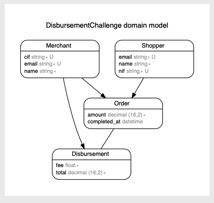

# README

## Pre Prerequisites:

- Ruby 3.0.2
- Redis
- Postgresql
- Required docker installed (in case you want to run redis and Postgresql in it)

## Setup

- Running Postgresql

```docker run --name postgresql -p 5432:5432 -e POSTGRES_PASSWORD=postgres -d postgres ```

- Running Redis

```docker run -d --name redis -p 127.0.0.1:6379:6379 redis ```

- Installing dependencies:

``` bundle install ```

- Creating database:

``` rails db:create db:migrate ```

- In case of failure please check:

``` .env ``` file

- Load initial data:

``` rake setup:load_data  ```

- Running server

``` rails s ```

- Running Sidekiq (Background jobs) in a new terminal:

```bundle exec sidekiq ```

- Running tests

``` rspec ```



## ROUTES:

### Create disbursement: POST
> /disbursement

> body
```JSON
{
  "start_date": "2010-01-01",
  "end_date": "2021-12-12",
  "merchant_id": 6
}
```

> response

```JSON
{
  "start_date": "2010-01-01T00:00:00.000+00:00",
  "end_date": "2021-12-12T00:00:00.000+00:00",
  "merchant_id": 6,
  "status": "calculating"
}
```

### INDEX disbursement: GET
> /disbursement

> PARAMS
```JSON
"start_date": "2010-01-01" (OPTIONAL)
"end_date": "2021-12-12" (OPTIONAL)
"merchant_id": 6 (OPTIONAL)
```

> response

```JSON
{
  "RECORDS": [
    {
      "id": 135,
      "merchant_id": 6,
      "order_id": 46,
      "fee": 0.0085,
      "total": "335.78",
      "created_at": "2021-10-16T16:17:00.643Z",
      "updated_at": "2021-10-16T16:17:00.643Z"
    },
    {
      "id": 144,
      "merchant_id": 6,
      "order_id": 68,
      "fee": 0.0095,
      "total": "259.39",
      "created_at": "2021-10-16T16:17:00.698Z",
      "updated_at": "2021-10-16T16:17:00.698Z"
    },
  ]
}
```

## Todo

- Improve tests, better test suite
- Manage status in disbursements